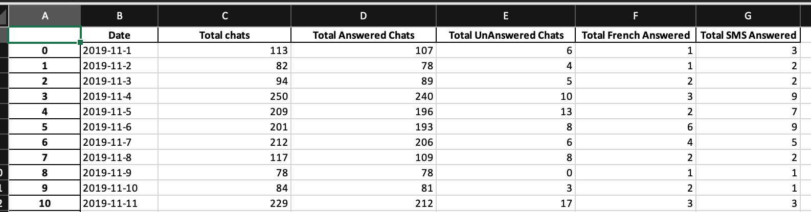

# SP Ask Running Total Daily report
An helper that create and Excel document representing the number of chats per day. Which are on the Daily Spreadsheet

### Installation

    $ pip install sp_ask_running_total_daily_report
    $ or with poetry
    $ poetry add sp_ask_running_total_daily_report

### Utilisation
```python
from sp_ask_running_total_daily_report import create_report

for month_number in range(1, 13):
    create_report(2019, month_number)
```

### Screenshot
[]